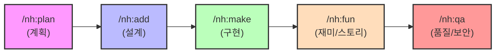

# Gemini Harness Engineering: 시스템 아키텍처 및 워크플로우

---

## [Slide 1] 시스템 개요 (System Overview)

본 시스템은 **제미나이 CLI**를 기반으로 한 **단계별 자율 협업 프레임워크**입니다. 모든 개발 공정은 엄격한 순차적 검증 프로세스를 따르며, 마크다운(MD) 파일을 통해 상태(State)를 관리합니다.

### 🛠 핵심 구성 요소
- **Main Agent:** 워크플로우 오케스트레이션 및 도구 실행
- **Sub-Agents:** 단계별 전문 페르소나(Persona) 기반 검증 및 생성
- **Configuration (Harness):** `.gemini/configs/*.md`를 통한 단계별 헌법 정의

---

## [Slide 2] 5단계 표준 워크플로우 (The 5-Step Process)



### 📋 단계별 산출물 (Artifacts)
1. `plan.md`: 기술 스택 및 아키텍처 결정 사항
2. `add.md`: 상세 클래스/API/데이터 설계서
3. `make.md`: 구현 요약 및 변경 이력 보고서
4. `fun.md`: 스토리 일관성 및 UX 재미 검증서
5. `qa.md`: 기술 결함 및 보안 감사 보고서

---

## [Slide 3] 서브 에이전트 페르소나 매핑 (Sub-Agent Personas)

`generalist` 서브 에이전트는 각 단계의 설정 파일에 따라 다음과 같이 가변적인 역할을 수행합니다.

| 단계 | 명령어 | 에이전트 페르소나 | 주요 임무 |
| :--- | :--- | :--- | :--- |
| **Plan** | `/nh:plan` | 시니어 아키텍트 | 기술 타당성 검토 (0.95점 이상 승인) |
| **Add** | `/nh:add` | 테크니컬 라이터 | 상세 설계 및 Blueprint 작성 |
| **Make** | `/nh:make` | 시니어 개발자 | 클린 코드 구현 및 기술 부채 관리 |
| **Fun** | `/nh:fun` | 스토리 디렉터 | 세계관 일관성 및 재미 요소(UX) 검증 |
| **QA** | `/nh:qa` | 보안 감사관 | 화이트박스 테스트 및 보안 취약점 감사 |

---

## [Slide 4] 설정 아키텍처 (Configuration Structure)

설정 파일은 **중앙 제어 및 세부 실행 지침**의 계층 구조를 가집니다.

```text
/ Users/myungkeunpark/study/gemini_project/
├── GEMINI.md                  # [Core] 전체 프로세스 및 실행 순서 정의 (헌법)
└── .gemini/
    └── configs/               # [Harness] 단계별 세부 지침 및 페르소나 설정
        ├── plan_rules.md      # 전략 및 기술 스택 검증 기준
        ├── add_rules.md       # 설계의 완전성 검증 기준
        ├── make_rules.md      # 코드 품질 및 컨벤션 지침
        ├── fun_rules.md       # 스토리 및 재미 분석 프레임워크
        └── qa_rules.md        # 보안 및 기술 성능 감사 체크리스트
```

---

## [Slide 5] 기술적 특징 및 장점 (Technical Advantages)

1. **상태 기반 진행 (State-Based Progress)**
   - 각 단계의 `.md` 파일이 생성되지 않으면 다음 명령어를 수행할 수 없는 엄격한 순차 시스템.
2. **페르소나 최적화 (Persona Optimization)**
   - 한 명의 에이전트가 아닌, 단계별로 최적화된 전문가의 시선으로 결과물을 검토.
3. **재미 가점 시스템 (Fun-First Engineering)**
   - 단순 구현을 넘어 사용자의 감성적 만족도와 스토리의 힘을 기술 단계에 편입(`/nh:fun`).
4. **자동화된 기록 (Automated Logging)**
   - 모든 검증 과정과 결과가 문서로 남아이력 관리가 용이함.

---

## [Slide 6] 향후 확장 계획 (Future Roadmap)

- **커스텀 서브 에이전트 도입**: 특정 언어나 프레임워크에 특화된 전용 에이전트 추가.
- **자동 QA 자동화 연동**: `qa.md` 작성 시 실제 테스트 도구(Jest, Pytest 등) 결과와 연동.
- **시각화 대시보드**: 프로젝트 진행 상황을 실시간 그래프로 표현하는 도구 개발.
